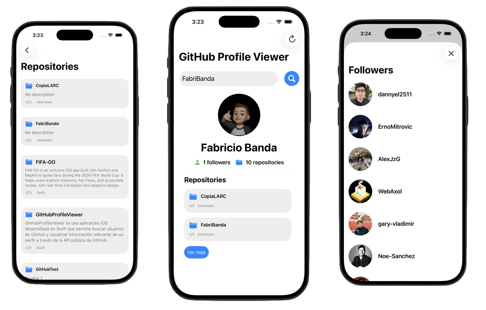

# GitHubProfileViewer

A SwiftUI application that allows users to search for GitHub profiles and display relevant public information using the GitHub REST API.
This project was developed as a technical test, focusing on clean architecture, proper state management, and modern SwiftUI practices.

## Preview
<p align="center">
  
</p>

## Installation Instructions 

### 1. Clone this repository

```bash
git clone https://github.com/FabriBanda/GitHubProfileViewer.git
```

### 2.	Open the project in Xcode 15 or later.
### 3.	Select an iOS Simulator or a physical device.
### 4.	Run the project

> No additional configuration or API keys are required, as the app uses the public GitHub API.

## Features

-  **Search GitHub users by username**

- **Display user profile information**
  - Avatar
  - Name
  - Followers count
  - Public repositories count

-  **Display repositories**
-  **Preview of the first repositories on the profile screen**
-  **Full repositories list on a separate screen**

-  **Display followers list in a modal sheet**

-  **Display avatar image in a modal sheet**

-  **Persist last searched username**

-  **Reset search using a navigation bar button**

-  **Handle loading and error states**

## Architecture and Technical Decisions

### 1. MVVM Architecture

The app follows the Model–View–ViewModel (MVVM) architecture to ensure:
- Clear separation of concerns
- Better maintainability
- Easier scalability

### 2. State-driven UI

A `ViewState` enum is used to drive the UI:
- `idle`
- `loading`
- `success`
- `error(String)`

This allows the UI to react clearly to each stage of the data lifecycle.

### 3. Networking with async/await

API calls are implemented using:
- `URLSession`
- `async/await`
- Explicit handling of `HTTPURLResponse` status codes


### 4. Persistence with UserDefaults

Only the username is persisted using `UserDefaults`, avoiding unnecessary data storage while still restoring the previous session.

---

## API Endpoints Used

- `GET /users/{username}`
- `GET /users/{username}/repos`
- `GET /users/{username}/followers`

## Challenges and Solutions

### 1. Handling multiple API requests

**Challenge:** Fetching user data, repositories, and followers simultaneously.  
**Solution:** Split each request into dedicated functions and coordinate them from a single `fetchAll` method.

---

### 2. Error handling

**Challenge:** Differentiating between user not found, network errors, and server errors.  
**Solution:** Inspect `HTTPURLResponse.statusCode` and handle errors accordingly, displaying messages.

---

### 3. State inconsistencies when searching multiple users

**Challenge:** Old data appearing when performing a new search.  
**Solution:** Reset the state and cached data before starting a new fetch.

---

### 4. Sheet presentation issues

**Challenge:** Sheet not appearing on first tap.  
**Solution:** Use an enum conforming to `Identifiable` to properly manage sheet presentation.


## Future Improvements

- Add pagination for repositories and followers
- Implement a dedicated networking service layer
- Add unit tests for ViewModel logic
- Improve accessibility support
- Cache API responses for better performance


## Additional Notes
### Architecture Pattern

- MVVM (Model–View–ViewModel)

---

## Technologies Used

- Swift
- SwiftUI
- Combine
- async / await
- URLSession
- UserDefaults
- GitHub REST API

## Author

Fabricio Banda  
iOS Developer | Robotics & Digital Systems Engineering Student


